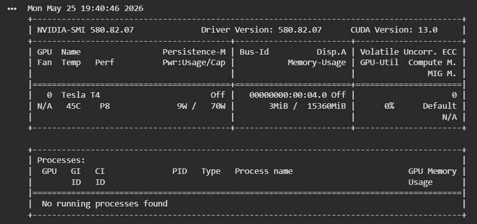
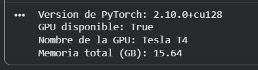

# Entrenamiento de Redes Neuronales en GPU
* CUDA con PyTorch en Google Colab

---

| | |
|---|---|
| **Parcial** | Segundo Corte |
| **Materia** | Programación Paralela y Computación Distribuida |
| **Profesor** | Juan Alejandro Jaimes |
| **Integrantes** | Julio Martinez Triana, David Cuadrado |
| | |
| **Fecha** | 25/05/26x |

---

## 0. Instrucciones Generales
* El taller se desarrolla en Google Colab usando una GPU gratuita de NVIDIA.
* Se trabaja en parejas; ambos integrantes deben entender cada parte.
* Se deben capturar pantallazos de cada salida importante indicada con [PANTALLAZO].
* Al finalizar, se descarga el notebook y se sube todo a un repositorio de GitHub.

### Preguntas
1. ¿Qué diferencia hay entre un notebook en la nube (Colab) y un entorno local como el del tutorial de instalación? ¿Cuál prefieren y por qué?
Dentro de un entorno local podemos seleccionar nuestra grafica que utilice nuestro dispositivo, mientras que en el entorno de Google Collab usa una grafica especifica distribuida por este entorno, los tiempos de respuesta varian por la velocidad del internet, mientras que localmente varia segun la velocidad de la grafica que estemos usando, preferimos la version local ya que tenemos una grafica relativamente rapida, pero Google collab es una buena opcion para las personas que no dispongan de una tarjeta grafica.
2. Antes de comenzar, hagan una predicción: ¿cuántas veces más rápida creen que será la GPU comparada con la CPU en el entrenamiento? Anoten su predicción aquí y compárenla al final con el resultado real.
Almenos deberia ser unas 2 veces mas rapida.
---

## 1. Configurar el Entorno en Google Colab
* Activar la GPU desde el menú de Colab: Entorno de ejecución > Cambiar tipo de entorno de ejecución.
* Verificar que PyTorch reconoce la GPU y mostrar el nombre del dispositivo.
* Ejecutar `nvidia-smi` para ver el estado de la GPU, igual que en el tutorial de instalación.

### Preguntas
1. La salida de `nvidia-smi` muestra campos como *Driver Version*, *Memory Usage* y *GPU-Util*. ¿Qué indica cada uno?
Driver Version muestra la version de Nvidia que esta instalada en el entorno de Google Collab, Memory Usage indica la cantidad de uso de VRAM de la tarjeta grafica actualmente y cuanta VRAM hay disponible, y por ultimo GPU-Util indica el uso del procesamiento grafico de la GPU.   
2. Cuando activan el acelerador en Colab, ¿qué creen que ocurre físicamente? ¿La GPU está en su computador o en otro lugar? Propongan una analogía con algo de la vida cotidiana.
Collab solamente mostrara la opcion de usar una CPU local si esta disponible, pero directamente usa una GPU de sus propios servidores, por lo que la GPU estaria en otro lugar. Imaginemos que tenemos un carro, este queda varado en tu casa y necesitas llevarlo al taller, tu tienes otro carro, entonces puedes decidir llevarlo arrastrado con tu otro carro usando una cuerda, o llamar un servicio de gruas para que lleve tu carro.
3. `torch.cuda.is_available()` retorna `True` o `False`. ¿Qué condiciones deben cumplirse para que retorne `True`? Listen al menos tres requisitos.
Este retorna True, para que este retorne TRUE necesitamos tener una GPU NVIDIA que tenga compatibilidad con CUDA, tener instalados los drivers de CUDA y tener CUDA Toolkit compatible.
**Pantallazos:**


**Pantallazos:**


---

## 2. Conceptos: CPU vs GPU en PyTorch
* Comparar las operaciones de CUDA en C con su equivalente en PyTorch.
* Entender cómo se mueven tensores entre CPU y GPU con `.to('cuda')`.
* Definir el dispositivo al inicio del proyecto para que el código funcione con o sin GPU.

### Preguntas
1. En el tutorial anterior usaron `cudaMemcpy` para mover datos entre CPU y GPU. En PyTorch eso se hace con `.to('cuda')`. ¿Qué ventaja le ven a la forma de PyTorch? ¿Qué se pierde al abstraerlo tanto?
Pues podemos ver que al usar cudaMemcpy(destino, recepcion, tipo de dato, operacion), es una estructura mucho mas larga, en donde solo con .to('cuda') tenemos una estructura mas simplificada y facil de recordar, al igual que el manejo de memoria es mucho mas simplificado, dentro de Pytorch podemos ver que tenemos mucho menos control interno de la memopria gracias a su simplicidad de su estructura, mientras que en CUDA tenemos una estructura mucho mas especifica donde podemos encontrar opciones mas avanzadas.
2. Diagramen en Excalidraw el flujo de un tensor desde que se crea en CPU hasta que se opera en GPU y el resultado vuelve a CPU. Etiqueten cada flecha con la operación de PyTorch correspondiente.
3. ¿Por qué es una buena práctica usar la variable `device = torch.device('cuda' if torch.cuda.is_available() else 'cpu')` en lugar de escribir `'cuda'` directamente en el código?
Porque este hace el codigo mucho mas seguro que y portatil, ya que verifica automaticamente que el dispositivo tenga una GPU Nvidia y que tenga CUDA disponible.

---

## 3. Preparar los Datos: Dataset MNIST
* Descargar el dataset MNIST: 60,000 imágenes de entrenamiento y 10,000 de prueba.
* Aplicar transformaciones para convertir las imágenes a tensores y normalizarlas.
* Visualizar una muestra del dataset para entender qué se va a clasificar.

### Preguntas
1. El dataset se divide en 60,000 imágenes de entrenamiento y 10,000 de prueba. ¿Por qué no se entrena con todas las 70,000? Propongan una analogía con estudiar para un examen.
No se entrena con las 70,000 imágenes porque necesitamos separar una parte de los datos para evaluar si el modelo realmente aprendió a generalizar y no solo a memorizar. Las 60,000 imágenes de entrenamiento se usan para que la red ajuste sus pesos, mientras que las 10,000 imágenes de prueba se usan después para medir qué tan bien reconoce dígitos que nunca vio durante el entrenamiento.
Una analogía sería estudiar para un examen: los ejercicios del libro o de clase serían los datos de entrenamiento, porque con ellos practicamos. El examen real sería el conjunto de prueba, porque contiene preguntas nuevas que sirven para comprobar si realmente entendimos el tema y no solo memorizamos las respuestas de práctica.


2. El `DataLoader` carga los datos en lotes (*batches*) de 64 imágenes. ¿Por qué no se pasan todas las imágenes de una sola vez a la GPU? Relacionen su respuesta con el concepto de memoria que vieron en `nvidia-smi`.
No se pasan todas las imágenes de una sola vez a la GPU porque la memoria de la GPU es limitada. En `nvidia-smi` se puede ver cuánta memoria total tiene la GPU y cuánta memoria está siendo usada. Si intentáramos cargar demasiadas imágenes al mismo tiempo, podríamos llenar la memoria de la GPU y provocar un error.

3. Cada imagen tiene forma `[1, 28, 28]`. Diagramen en Excalidraw qué representa cada dimensión y cómo luce ese tensor visualmente.

---

## 4. Construir la Red Neuronal
* Definir la arquitectura: capa de entrada (784), dos capas ocultas (256 y 128), capa de salida (10 dígitos).
* Mover el modelo a la GPU con `.to(device)`.
* Contar el total de parámetros entrenables de la red.

### Preguntas
1. Diagramen en Excalidraw la arquitectura completa de la red: entrada → capa 1 → capa 2 → salida. Indiquen el número de neuronas en cada capa y qué función de activación se usa entre ellas.
2. ¿Por qué la capa de entrada tiene exactamente 784 neuronas y la de salida exactamente 10? ¿Qué pasaría si pusieran 11 neuronas en la salida?
La capa de entrada tiene exactamente **784 neuronas** porque cada imagen de MNIST mide **28 x 28 píxeles**. Al aplanar la imagen, la matriz de 28 filas por 28 columnas se convierte en un vector de:

28 x 28 = 784 valores

Cada valor representa la intensidad de un píxel de la imagen, por eso la red necesita recibir **784 entradas**.

La capa de salida tiene exactamente **10 neuronas** porque el problema consiste en clasificar dígitos del **0 al 9**. Es decir, existen 10 clases posibles:

0, 1, 2, 3, 4, 5, 6, 7, 8 y 9

Cada neurona de salida representa la puntuación de una clase. La neurona con el valor más alto indica el dígito que el modelo predice.

Si se pusieran **11 neuronas** en la salida, la red estaría produciendo una clase extra que no existe en el dataset MNIST. Como las etiquetas reales solo van de 0 a 9, esa salida adicional no tendría una categoría válida asociada. Esto haría que la arquitectura no correspondiera correctamente al problema y podría generar predicciones sin sentido, porque el modelo tendría una posible respuesta número 11 que no representa ningún dígito real del conjunto de datos.

3. Cuando hacen `modelo.to(device)`, ¿qué creen que se está transfiriendo a la GPU? ¿Es solo el código, o algo más? Propongan una analogía con el tutorial de CUDA en C.
Cuando se ejecuta `modelo.to(device)`, no se está transfiriendo solamente el código de la red. Lo que realmente se mueve a la GPU son los **parámetros entrenables del modelo**, es decir, los **pesos y sesgos** de cada capa.

En esta red neuronal, esos parámetros pertenecen a las capas lineales:

- `nn.Linear(784, 256)`
- `nn.Linear(256, 128)`
- `nn.Linear(128, 10)`

Cada una de esas capas tiene matrices de pesos y vectores de sesgos. Esos valores son los que la red va ajustando durante el entrenamiento para aprender a reconocer los dígitos.

Es importante mover el modelo a la GPU porque las imágenes también se envían a la GPU con `.to(device)`. Si los datos están en GPU pero los pesos del modelo están en CPU, PyTorch no puede hacer las operaciones entre ellos y genera un error de dispositivos.

Una analogía con CUDA en C sería la siguiente: en CUDA manual, primero se reserva memoria en la GPU con `cudaMalloc`, luego se copian los datos desde la CPU hacia la GPU con `cudaMemcpy`. En PyTorch, `modelo.to(device)` hace algo parecido para los pesos del modelo: coloca las matrices de pesos y sesgos en la memoria de la GPU para que las operaciones de entrenamiento se ejecuten allí.
---

## 5. Entrenar el Modelo: CPU vs GPU
* Entrenar el mismo modelo dos veces: primero en CPU, luego en GPU.
* Medir el tiempo de entrenamiento en cada dispositivo.
* Comparar los resultados y calcular cuántas veces más rápida fue la GPU.

**Código de Entrenamiento con perdida**

```python
def entrenar_con_loss(modelo, train_loader, test_loader, dispositivo, title, epocas=3):
    criterio = nn.CrossEntropyLoss()
    optimizador = optim.Adam(modelo.parameters(), lr=0.001)

    historico_train = []
    historico_test  = []

    modelo.train()
    inicio = time.time()

    for epoca in range(epocas):
        # --- Training loss ---
        modelo.train()
        loss_train = 0
        for imagenes, etiquetas in train_loader:
            imagenes = imagenes.to(dispositivo)
            etiquetas = etiquetas.to(dispositivo)

            prediccion = modelo(imagenes)
            perdida = criterio(prediccion, etiquetas)

            optimizador.zero_grad()
            perdida.backward()
            optimizador.step()

            loss_train += perdida.item()

        # --- Test loss ---
        modelo.eval()
        loss_test = 0
        with torch.no_grad():
            for imagenes, etiquetas in test_loader:
                imagenes = imagenes.to(dispositivo)
                etiquetas = etiquetas.to(dispositivo)
                prediccion = modelo(imagenes)
                perdida = criterio(prediccion, etiquetas)
                loss_test += perdida.item()

        avg_train = loss_train / len(train_loader)
        avg_test  = loss_test  / len(test_loader)

        historico_train.append(avg_train)
        historico_test.append(avg_test)

        print(f"Epoca {epoca+1}/{epocas} - Train loss: {avg_train:.4f} | Test loss: {avg_test:.4f}")

    tiempo = time.time() - inicio

    # --- Graficar ---
    plt.figure(figsize=(8, 4))
    plt.plot(range(1, epocas+1), historico_train, label='Training loss', linewidth=2)
    plt.plot(range(1, epocas+1), historico_test,  label='Test loss',     linewidth=2, linestyle='--')
    plt.xlabel('Epoca')
    plt.ylabel('Loss')
    plt.title(f'Curva de Aprendizaje {title}')
    plt.legend()
    plt.grid(True)
    plt.tight_layout()
    plt.show()

    return historico_train, historico_test, tiempo
```

### Preguntas
1. Registren aquí los tiempos obtenidos. ¿El resultado coincidió con la predicción que hicieron en la sección 0? ¿Qué los sorprendió?
El tiempo obtenido en CPU fue de **49.87 segundos** y el tiempo obtenido en GPU fue de **46.18 segundos**. Al comparar ambos tiempos, la GPU fue aproximadamente **1.1x más rápida** que la CPU.

Nuestra predicción inicial fue que la GPU sería aproximadamente **2x más rápida** que la CPU. Sin embargo, el resultado real no coincidió con la predicción, porque la diferencia fue menor: la aceleración obtenida fue de solo **1.1x**.

Lo que más nos sorprendió fue que la GPU sí fue más rápida, pero no tanto como esperábamos. Esto puede explicarse porque el modelo usado es relativamente pequeño, el dataset MNIST tiene imágenes de baja resolución y la memoria usada en la GPU fue baja, aproximadamente **23.9 MB**. Además, existe un costo adicional al mover datos entre CPU y GPU, por lo que en modelos pequeños la ventaja de la GPU no siempre se nota tanto. Aun así, la comparación muestra que la GPU Tesla T4 logró reducir el tiempo de entrenamiento frente a la CPU.

2. El entrenamiento repite el ciclo: *predicción → error → ajuste de pesos*. Propongan una analogía con algo cotidiano que siga el mismo ciclo de mejora por repetición.
Una analogía cotidiana es aprender a lanzar un balón a una canasta. Primero se realiza un lanzamiento, que sería la predicción. Luego se observa qué tan cerca o lejos quedó el balón del objetivo, eso sería el error. Después se ajusta la fuerza, la dirección o la postura para intentar mejorar en el siguiente lanzamiento, eso sería el ajuste de pesos.

3. ¿Por qué creen que la GPU es más rápida en esta tarea? Relacionen su respuesta con el concepto de hilos y bloques que vieron en el tutorial de CUDA en C.

La GPU es más rápida en esta tarea porque el entrenamiento de una red neuronal requiere muchas operaciones matemáticas repetidas, especialmente multiplicaciones de matrices, sumas y cálculos sobre muchos datos al mismo tiempo. Estas operaciones se pueden paralelizar muy bien.

En CUDA, los cálculos se distribuyen en muchos hilos organizados en bloques. Cada hilo puede encargarse de una pequeña parte del trabajo, por ejemplo operar sobre ciertos valores de una matriz o de un lote de imágenes. Esto permite que la GPU procese muchas operaciones simultáneamente.

La CPU tiene menos núcleos y está diseñada para tareas más generales y secuenciales. En cambio, la GPU tiene muchos núcleos más simples y está diseñada para ejecutar miles de operaciones parecidas en paralelo. Por eso, para entrenar redes neuronales, la GPU suele ser más rápida que la CPU.

### Análisis de la Curva de Aprendizaje

Antes de responder, observen su gráfica generada y usen esta escala para interpretar el Loss:

| Loss final | Interpretación |
|---|---|
| 1.0 o más | La red no aprendió nada, está adivinando al azar |
| 0.3 - 0.5 | Aprendiendo, pero todavía comete muchos errores |
| 0.1 - 0.2 | Bien, la red entiende el problema |
| 0.07 o menos | Muy bien, la red generaliza correctamente |
| 0.01 o menos | Casi perfecto |

**Analogía:** el Training loss son los errores practicando con ejercicios del libro que ya conocen. El Test loss son los errores en el examen real, con preguntas que nunca vieron. Al inicio la red falla mucho con los ejercicios porque no sabe nada, pero como tampoco ha memorizado nada raro, falla de forma pareja en el examen. Conforme avanza, domina los ejercicios y eso se traduce en mejora en el examen real — ahí es donde las dos líneas convergen.

### Preguntas

1. Según la escala, ¿en qué rango quedó el Loss final de su modelo? ¿Lo consideran un buen resultado para 3 épocas? Justifiquen con base en la gráfica que generaron.
Según la escala dada, el loss final quedó aproximadamente en el rango de **0.07 o menos**, especialmente en el entrenamiento, donde el modelo terminó con un `Train loss` cercano a **0.0675**. En prueba, el `Test loss` terminó aproximadamente en **0.0722**, muy cercano al rango de “muy bien”.

2. Observen en qué época convergen las dos líneas. ¿Qué creen que pasaría si entrenaran 2 épocas más — el loss seguiría bajando indefinidamente o en algún punto se detendría? ¿Qué riesgo aparece si se entrena demasiado?
En las gráficas, las líneas de `Training loss` y `Test loss` se acercan bastante entre la **época 2 y la época 3**. En la curva de GPU se observa que ambas líneas casi convergen al final de la tercera época, y en la curva de CPU también se acercan bastante.
El riesgo de entrenar demasiado es el **sobreajuste**. Esto ocurre cuando el modelo empieza a memorizar demasiado los datos de entrenamiento en lugar de aprender patrones generales. En ese caso, el `Training loss` seguiría bajando, pero el `Test loss` podría dejar de bajar o incluso comenzar a subir. Eso indicaría que el modelo funciona muy bien con los datos que ya vio, pero peor con datos nuevos.
---

## 6. Evaluar y Visualizar Resultados
* Calcular la precisión del modelo sobre los datos de prueba que nunca vio durante el entrenamiento.
* Visualizar predicciones reales con indicadores de acierto (verde) y error (rojo).

### Preguntas
1. ¿Por qué la precisión se mide sobre datos que el modelo nunca vio durante el entrenamiento y no sobre los mismos datos con los que aprendió?
La precisión se mide sobre datos que el modelo nunca vio durante el entrenamiento para comprobar si realmente aprendió a generalizar. Si se midiera la precisión usando los mismos datos con los que entrenó, el resultado podría ser engañoso, porque el modelo podría haber memorizado esas imágenes en lugar de aprender patrones generales.
El conjunto de prueba permite evaluar el comportamiento del modelo frente a ejemplos nuevos. En este caso, las imágenes de prueba representan dígitos que no fueron usados para ajustar los pesos de la red, por lo que sirven para medir de forma más justa qué tan bien funciona el modelo.

2. Observen los dígitos que el modelo clasificó mal. ¿Tienen algo en común? ¿Por qué creen que la red se equivocó en esos casos específicos?
En la visualización de predicciones, el modelo clasificó mal un dígito: el valor real era **5**, pero el modelo lo predijo como **6**.

Este error puede ocurrir porque algunos dígitos escritos a mano tienen formas ambiguas. En este caso, el **5** tiene una parte inferior curva y cerrada que puede parecerse a la forma de un **6**. Como la red neuronal aprende a partir de patrones visuales, si un dígito tiene trazos parecidos a otra clase, puede confundirse.

En general, los errores suelen aparecer en dígitos con escritura poco clara, trazos incompletos, inclinaciones fuertes o formas similares entre clases, como 5 y 6, 4 y 9, o 3 y 8.

3. Si quisieran mejorar la precisión del modelo, ¿qué cambiarían de la arquitectura o del entrenamiento? Propongan al menos dos modificaciones y justifiquen cada una.
Para mejorar la precisión del modelo se podrían hacer varias modificaciones:

Primero, se podría entrenar durante más épocas. En este taller se entrenó solo durante **3 épocas**, y las curvas de pérdida todavía muestran que el modelo puede seguir mejorando un poco. Aumentar a 5 o más épocas podría permitir que la red ajuste mejor sus pesos y reduzca algunos errores.

Segundo, se podría usar una arquitectura más adecuada para imágenes, como una red neuronal convolucional, también llamada **CNN**. La red actual es una red densa que aplana la imagen de 28x28 a un vector de 784 valores, perdiendo parte de la estructura espacial de la imagen. Una CNN puede detectar mejor bordes, curvas y formas locales, por lo que suele funcionar mejor en clasificación de imágenes.

También se podría mejorar el preprocesamiento o usar técnicas de aumento de datos, como pequeñas rotaciones, desplazamientos o cambios de escala. Esto ayudaría a que el modelo aprenda a reconocer dígitos escritos de diferentes maneras y sea menos sensible a variaciones en la escritura.

---

## 7. Prueba tu Propio Dígito
* Dibujar un dígito del 0 al 9 en Paint (o cualquier editor), guardarlo como imagen.
* Subir la imagen a Colab y preprocesarla para que tenga el mismo formato que MNIST: escala de grises, fondo negro, trazo blanco, tamaño 28x28.
* Pasarla al modelo entrenado y ver qué predice.
* Visualizar la imagen tal como la ve la red antes de hacer la predicción.

**codigo ejemplo**
```python
from google.colab import files
from PIL import Image, ImageOps
import torchvision.transforms as transforms
import matplotlib.pyplot as plt
import numpy as np

def procesar_imagen(nombre):
    original = Image.open(nombre).convert('L')
    
    # 1. Recortar bordes (quita sombras y bordes de hoja)
    w, h = original.size
    recortada = original.crop((w*0.05, h*0.05, w*0.95, h*0.95))
    
    # 2. Aumentar contraste para separar trazo del fondo
    from PIL import ImageEnhance, ImageFilter
    contraste = ImageEnhance.Contrast(recortada).enhance(3.0)
    
    # 3. Suavizar ruido de arrugas
    suavizada = contraste.filter(ImageFilter.MedianFilter(size=3))
    
    # 4. Invertir colores (fondo negro, trazo blanco como MNIST)
    invertida = ImageOps.invert(suavizada)
    engrosada = invertida.filter(ImageFilter.MaxFilter(size=3))
    
    # 5. Escalar a 28x28
    procesada = engrosada.resize((28, 28), Image.LANCZOS)
    
    # Visualizar las etapas
    fig, axes = plt.subplots(1, 4, figsize=(12, 3))
    
    axes[0].imshow(recortada, cmap='gray')
    axes[0].set_title('1. Recortada')
    axes[0].axis('off')
    
    axes[1].imshow(contraste, cmap='gray')
    axes[1].set_title('2. Contraste')
    axes[1].axis('off')
    
    axes[2].imshow(invertida, cmap='gray')
    axes[2].set_title('3. Invertida')
    axes[2].axis('off')
    
    axes[3].imshow(np.array(procesada), cmap='gray')
    axes[3].set_title('4. Lo que ve la red (28x28)')
    axes[3].axis('off')
    
    plt.tight_layout()
    plt.show()
    
    return procesada

subido = files.upload()
nombre = list(subido.keys())[0]

imagen = procesar_imagen(nombre)

# Pasar al modelo
transform = transforms.Compose([
    transforms.ToTensor(),
    transforms.Normalize((0.1307,), (0.3081,))
])

tensor = transform(imagen).unsqueeze(0).to('cuda')

modelo_gpu.eval()
with torch.no_grad():
    salida = modelo_gpu(tensor)
    prediccion = salida.argmax(dim=1).item()

print(f'El modelo GPU predice: {prediccion}')

modelo_cpu.eval()
with torch.no_grad():
    tensor_cpu = transform(imagen).unsqueeze(0).to('cpu')
    salida = modelo_cpu(tensor_cpu)
    prediccion = salida.argmax(dim=1).item()

print(f'El modelo CPU predice: {prediccion}')
```


### Preguntas
1. ¿El modelo acertó con tu dígito dibujado a mano? Si falló, ¿por qué creen que se equivocó? Comparen su imagen con las del dataset MNIST — ¿se ven similares o muy diferentes?
Sí, el modelo acertó con el dígito dibujado a mano. La imagen correspondía a un **3** y tanto el modelo en GPU como el modelo en CPU predijeron correctamente el valor **3**.

La imagen procesada se parece parcialmente a las imágenes del dataset MNIST, porque después del preprocesamiento queda con fondo oscuro, trazo claro y tamaño de **28x28 píxeles**, que es el formato esperado por la red. Sin embargo, también tiene algunas diferencias: el trazo proviene de una foto real tomada a una hoja, por lo que aparecen sombras, variaciones de iluminación y un fondo que no es completamente negro. Aun así, el modelo logró reconocer correctamente el patrón general del número 3.

2. El preprocesamiento invierte los colores de la imagen (`ImageOps.invert`). ¿Por qué es necesario hacer eso antes de pasarla al modelo? ¿Qué pasaría si no se hiciera?
Es necesario invertir los colores porque las imágenes de MNIST tienen el formato de **fondo negro y dígito claro/blanco**. En cambio, una foto normal de un número escrito en una hoja suele tener **fondo claro y trazo oscuro**.

Si no se hiciera la inversión, la imagen tendría una distribución visual diferente a la que el modelo vio durante el entrenamiento. El modelo fue entrenado con dígitos claros sobre fondo oscuro, por lo que al recibir una imagen con fondo blanco y trazo negro podría confundirse o clasificar mal el número. La inversión ayuda a que la imagen dibujada se parezca más al formato del dataset MNIST.

3. Prueben con un dígito que crean que va a fallar — por ejemplo un 4 o un 9 escritos de forma poco convencional. ¿Falló? ¿Qué dice eso sobre las limitaciones del modelo entrenado solo con MNIST?
Sí, el modelo falló con un dígito **4** escrito a mano. El valor real de la imagen era 4, pero el modelo GPU lo predijo como **7** y el modelo CPU lo predijo como **3**.

Este error puede explicarse porque el 4 escrito no se parece completamente a muchos ejemplos típicos del dataset MNIST. En la imagen procesada se observa un trazo vertical largo y una línea horizontal marcada, lo cual puede parecerse a un 7 para el modelo GPU. Además, las sombras, el grosor del trazo y el fondo irregular de la foto hacen que la imagen no sea idéntica al estilo limpio de MNIST.

Esto muestra una limitación importante del modelo: fue entrenado solo con imágenes de MNIST, que tienen un formato muy específico de 28x28 píxeles, fondo negro y dígito claro. Cuando recibe imágenes reales tomadas con cámara, con sombras, inclinación o estilos de escritura distintos, puede confundirse. Por eso, aunque el modelo tenga buena precisión en MNIST, no necesariamente generaliza perfectamente a cualquier número escrito a mano fuera del dataset.

4. Tomar captura, de almenos una predicción que se haya hecho correctamente.


Va justo después de la celda que compara CPU vs GPU. El enunciado:

---

### Bonus: ¿Qué tan seguro está el modelo?

Hasta ahora sabemos *qué* predice el modelo, pero no *qué tan seguro* está de su respuesta. Un modelo puede predecir "7" con un 95% de confianza o con un 40% — y eso hace toda la diferencia.

Ejecuten la siguiente celda para ver la distribución de probabilidades sobre los 10 dígitos para ambos modelos. Si el modelo está seguro, un dígito tendrá un porcentaje muy alto y los demás estarán cerca de 0. Si está dudando, verán los porcentajes distribuidos entre varios dígitos.

```python
# Ver qué tan seguro está cada modelo
import torch.nn.functional as F

with torch.no_grad():
    # GPU
    tensor_gpu = transform(imagen).unsqueeze(0).to('cuda')
    salida_gpu = modelo_gpu(tensor_gpu)
    prob_gpu = F.softmax(salida_gpu, dim=1)[0]
    
    # CPU
    tensor_cpu = transform(imagen).unsqueeze(0).to('cpu')
    salida_cpu = modelo_cpu(tensor_cpu)
    prob_cpu = F.softmax(salida_cpu, dim=1)[0]

print("Probabilidades GPU:")
for i, p in enumerate(prob_gpu):
    print(f"  {i}: {p.item()*100:.1f}%")

print("\nProbabilidades CPU:")
for i, p in enumerate(prob_cpu):
    print(f"  {i}: {p.item()*100:.1f}%")
```

**Observen y respondan:**
1. ¿Cuál dígito tiene la probabilidad más alta en cada modelo? ¿Coincide con la predicción?
El dígito con mayor probabilidad en ambos modelos fue el **3**. Sí, coincide con la predicción realizada por el modelo GPU
y por el modelo CPU, ya que ambos clasificaron la imagen como un **3**.


2. ¿El modelo está seguro o dudando? ¿Cómo lo saben mirando los porcentajes?
El modelo está seguro porque el porcentaje más alto corresponde al dígito **3** y supera el **90%** tanto en GPU como en CPU. 
Además, las probabilidades de los demás dígitos son mucho más bajas, lo que indica que el modelo no está repartiendo la confianza entre varias clases, sino que identifica claramente el dígito como un 3.

3. Si el porcentaje más alto es menor al 50%, ¿confiarían en esa predicción? ¿Por qué?
No confiaríamos completamente en esa predicción, porque si el porcentaje más alto es menor al 50%, significa que el modelo no está suficientemente seguro. En ese caso, la red estaría dudando entre varios dígitos y la predicción podría ser poco confiable. Sería necesario revisar la imagen, mejorar el preprocesamiento o probar con un modelo mejor entrenado.
---

El bloque de código lo reemplazas con la función completa que ya tenemos. ¿Lo agregamos también al markdown del taller?


## 8. Preguntas de Reflexión y Entregables
* Responder 4 preguntas que conectan lo aprendido en PyTorch con el tutorial de CUDA en C.
* Subir a GitHub el notebook descargado y un reporte en Markdown con pantallazos y respuestas.

### Preguntas
1. Ahora que completaron todo el taller, ¿en qué se parece PyTorch a programar en CUDA directamente y en qué se diferencia? ¿Cuándo usarían uno y cuándo el otro?
2. Diagramen en Excalidraw el flujo completo del taller: desde la activación de la GPU hasta la predicción final. Úsenlo como resumen visual de todo lo que hicieron.
3. Si tuvieran que explicarle este taller a alguien que nunca ha programado, ¿cómo describirían en una sola analogía lo que hace una red neuronal entrenándose en una GPU?